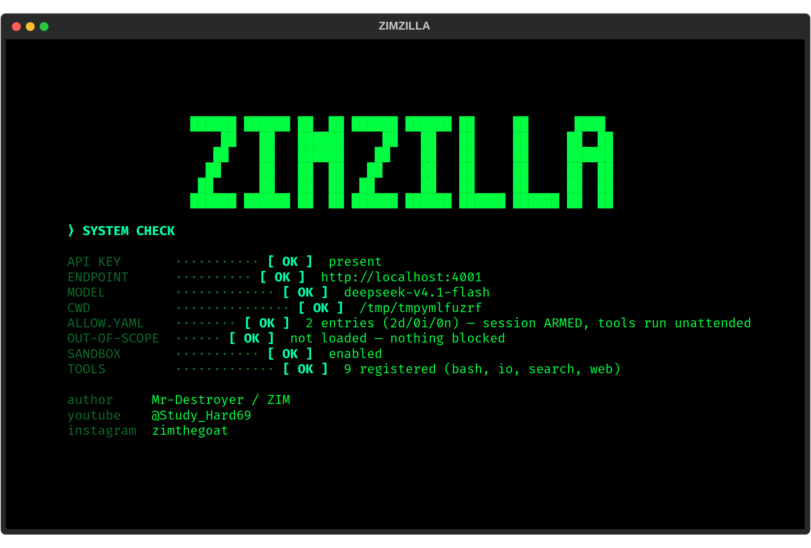
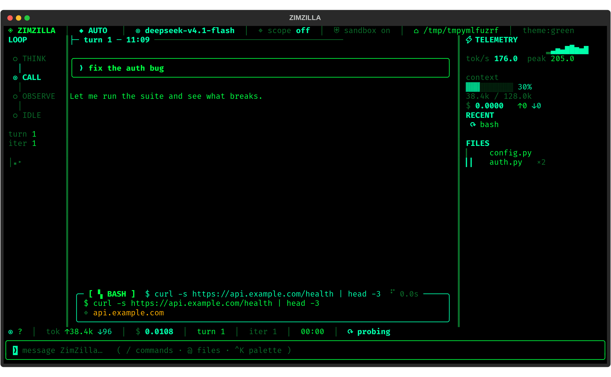
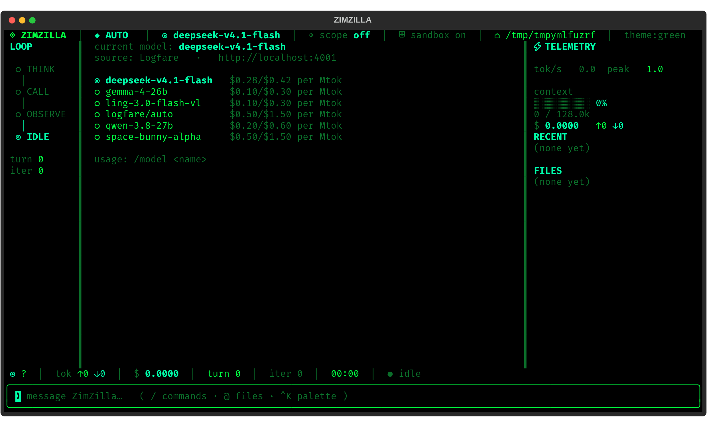
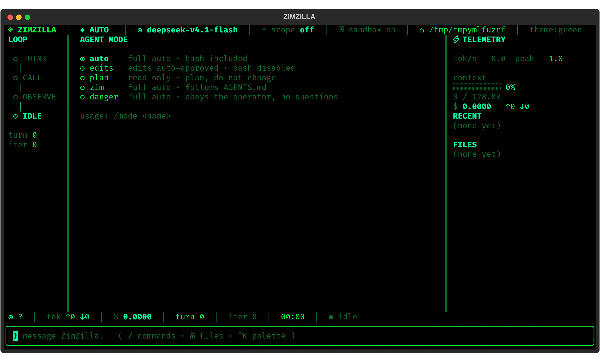

<div align="center">



**An autonomous coding agent that lives in your terminal.**

It reads your repo, runs commands, writes files, chases down bugs and
keeps going until the job is done — while you watch it work.

<sub>by **Mr-Destroyer / ZIM**</sub>


</div>



---

## See it

<div align="center">

### Cold start



*Banner reveal, a live system check, then the shell takes over.*

### The shell



*A transcript that streams, a tool card that shows the call while it runs,
and two rails that keep the loop and the cost in view. The left rail is the
agent's state — think, call, observe, idle. The right rail is the bill:
throughput, how full the context is, what it has cost, which files it touched.*

<table>
<tr>
<td width="50%">



**Swap engines mid-session.**<br>
<sub>Prices in, prices out. No restart, no lost context.</sub>

</td>
<td width="50%">



**Change how much rope it gets.**<br>
<sub>From read-only spectator to full send.</sub>

</td>
</tr>
</table>

</div>

---

## What it does

ZIMZILLA is a coding agent you drive from a terminal. You describe what you
want; it works out the steps, does them, and shows you everything it did.

- **Talks, then acts.** Ask a question and it answers. Ask for a change and it
  makes the change — reading files, running commands, editing code.
- **Sees your project.** Point it at any directory and it works there: it can
  read, search, and reason across the whole tree.
- **Runs real commands.** A full shell, wired straight into the loop, with
  output captured and shown inline.
- **Edits like a human.** Changes arrive as diffs you can read before they land.
- **Shows its work.** Every command, every file touched, every result — visible
  in the transcript as it happens, not buried in a log.
- **Keeps score.** Live token counts and a running cost estimate, per turn and
  per session.
- **Answers to a dial.** A mode switch decides whether it merely investigates,
  edits freely, or runs everything unattended.
- **Stays in bounds.** An optional scope file declares what it may touch, and a
  second declares what it must never go near.
- **Remembers the session.** Save it, load it, compact it when the context
  gets heavy.
- **Looks the part.** A green-on-black terminal, animated from boot to prompt.

---

## Install

```bash
git clone <this-repo> ~/zimzilla && cd ~/zimzilla
./install.sh        # venv, dependencies, a `zimzilla` command on PATH
./setup.sh          # verify the route end-to-end
```

Then, from any directory:

```bash
zimzilla                           # launch
zimzilla -C ~/some/project         # run against another directory
zimzilla --mode zim                # full auto, follows AGENTS.md
zimzilla --allow allow.yaml        # declare your targets
zimzilla --deny out-of-scope.yaml  # hosts that are never touched
```

Prefer not to install? `./run.sh` starts it straight from the checkout.

---

## Usage

```
--model, -m NAME     model to use
--workdir, -C DIR    working directory
--mode NAME          auto | edits | plan | zim | danger   (default: auto)
--allow PATH         declared targets — arms the session
--deny PATH          hosts that are never touched
--agents PATH        the doctrine file `zim` mode follows
--theme {green,amber,cyan}
--rain               start with matrix rain on
--no-rain            no rain anywhere
--max-tokens N       max output tokens per reply
--max-iterations N   ceiling on autonomous steps (default 40)
--unsafe             disable the filesystem jail
--list-models
--version
```

---

## Modes

The mode decides how much the agent is allowed to do on its own. Switch at
runtime with `/mode <name>`; the active mode is always visible in the header.

| Mode | Behaviour |
|---|---|
| `auto` *(default)* | **Full auto** — file writes and shell commands, no confirmation. |
| `edits` | File work is free; the shell is removed entirely. |
| `plan` | Read-only. Investigate, propose, change nothing. |
| `zim` | **Full auto**, governed by your `AGENTS.md`. |
| `danger` | **Full auto**, operator-directed — no questions asked. |

`zim` and `danger` are the **armed** modes: everything runs unattended, and the
header turns red to say so. A tool that a mode disallows does not merely get
discouraged — it stops existing for that session, so `plan` cannot write a file
even if you ask it to.

### zim mode and `AGENTS.md`

`zim` mode hands the wheel to a doctrine file of your choosing. Write the rules
you want followed; that file becomes the agent's whole operating manual. Found
automatically at `<workdir>/AGENTS.md`, or point at it with `--agents PATH`.

---

## Tools

| Tool | Asks first? | What it's for |
|---|---|---|
| `bash` | in some modes | Run a shell command. |
| `read_file` | no | Read a file, whole or by line range. |
| `write_file` | in some modes | Create or replace a file. |
| `edit_file` | in some modes | Surgical string replacement in a file. |
| `glob` | no | Find files by pattern. |
| `grep` | no | Search file contents by regex. |
| `list_dir` | no | List a directory. |
| `search_web` | no | Search the web. |
| `web_fetch` | no | Pull down a URL. |

When a mode makes a tool ask first, you get a modal showing the exact command
or a colour diff of the change, and three keys:

```
[y] run it     [n] no     [a] always, this session
```

---

## Scope

Two files, one job each. Both are picked up automatically from the working
directory, or pointed at with `--allow` / `--deny`.

**`allow.yaml` — your declared targets.** Its presence **arms the session**:
gated tools stop asking. It is a declaration of what you are authorised to
work on, not a fence around you — it restricts nothing and blocks nothing.

```yaml
domain:            # a domain also covers its subdomains
  - example.com
ip:
  - 203.0.113.10
cidr:
  - 198.51.100.0/24
```

**`out-of-scope.yaml` — never touch.** This one is enforced. A command that
reaches for one of these hosts is stopped before it runs, and fetching one is
refused outright.

```
⛔ BLOCKED — SCOPE GUARD — HARD BLOCK
   out-of-scope.example.com — denied — listed domain
```

```yaml
domain:
  - out-of-scope.example.com
```

Deny always beats allow. Loading only `out-of-scope.yaml` arms nothing — it
only subtracts.

### What this is and is not

Worth being straight about, because the difference matters:

- The allow-list is an **arming mechanism, not a safety control**. With it
  loaded, the only thing between the agent and an arbitrary host is
  `out-of-scope.yaml`.
- The deny-list is a **check on what it's about to do, not a sandbox**. It
  reads the command as written. A target assembled at runtime, or reached
  through an unlisted redirect, is not something it can see. It catches the
  obvious mistake; it does not stop a determined command.

Use it as a seatbelt, not as a cage.

### Upgrading from `scope.yaml`

`scope.yaml` is no longer read. It was one file doing three jobs at once, and
its meaning cannot be carried across safely — reading it as a deny-list would
block exactly the hosts it declared. A stale `scope.yaml` is reported loudly at
startup and then ignored. Rename it to `allow.yaml` or `out-of-scope.yaml`.

---

## Slash commands

| Command | Effect |
|---|---|
| `/help` | command reference |
| `/mode [name]` | show or switch mode |
| `/model [name]` | show or switch the model |
| `/cost` | session token + cost breakdown |
| `/scope` | scope status and entries |
| `/theme green\|amber\|cyan` | switch palette |
| `/rain` | toggle the matrix rain |
| `/save [name]` | write the session to disk |
| `/load [name]` | restore a session |
| `/compact` | summarise history to free context |
| `/clear` | wipe transcript and history |
| `/exit` | leave |

**Prompt affordances.** Type `/` and the command menu opens as you type; type
`@` and a file picker opens, rooted at your working directory. Accepting a file
mention attaches its contents to your message, so the agent can act on it
immediately. `↑`/`↓` to move, `Tab` to accept, `Esc` to dismiss.

**Keys.** `Ctrl+K` command palette · `Ctrl+C` interrupts the current turn ·
`Ctrl+D` exits · `Ctrl+L` clears.

The palette is the fastest way to reach anything: hit `Ctrl+K` and type a few
letters. It searches every slash command, every mode, every model on your
upstream, and every file in the working directory — so `/mode zim` is `mkz`,
and a file you half-remember is three characters away.

---

## Layout

```
install.sh                    venv + deps + PATH command
setup.sh                      route check
run.sh                        run from the checkout without installing

zimzilla/                     the package
  agent.py                    the tool-use loop and mode doctrine
  config.py                   modes, defaults, model registry, pricing
  tools.py                    the nine tools
  sandbox.py                  the filesystem jail
  scope.py                    allow.yaml / out-of-scope.yaml
  session.py                  save / load / list
  theme.py                    green / amber / cyan palettes
  ui/                         the terminal interface

allow.yaml.example            declared targets
out-of-scope.yaml.example     hosts that are never touched

docs/                         README graphics + screenshots
  gen_graphics.py             regenerate the animated header/hero SVGs
  gen_screenshots.py          re-shoot the screenshots from a live app
tests/                        the test suite
```

---

## Tests

```bash
.venv/bin/python tests/test_phase4.py
```

Stubs the model and drives the interface directly, so it needs no network and
no credentials.

---

## Troubleshooting

**`zimzilla: command not found`** — `~/.local/bin` is not on your PATH. Add
`export PATH="$HOME/.local/bin:$PATH"` and open a new shell.

**`no credentials found`** — run `./setup.sh`.

**`the endpoint rejected the model name`** — run `/model` for valid names.

**It says the endpoint is up but stalled** — something between you and the
model went quiet. It will time out rather than hang; check the endpoint is
actually serving.

---

<div align="center">
<sub>Built by <b>Mr-Destroyer / ZIM</b> · yt <b>@Study_Hard69</b> · ig <b>zimthegoat</b></sub>
</div>
